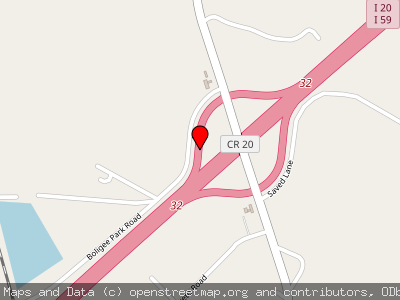

# Pulsar Bridges

Example Go code which generates png images of maps for every single highway bridge in the USA, using Apache Pulsar as a worker queue.



## Dependencies

This depends on the C++ Apache Pulsar development libraries, as well as some Go packages.  It also requires a standalone instance of Apache Pulsar running locally.

On a Mac you can install the Apache Pulsar development libraries with Brew

```
brew install https://raw.githubusercontent.com/apache/pulsar/master/pulsar-client-cpp/homebrew/libpulsar.rb
```

You'll currently need to follow the Pulsar documentation to [start a standalone cluster](https://pulsar.apache.org/docs/en/standalone/).

## Data

You can download the bridge data from the [National Bridge Inventory](https://www.fhwa.dot.gov/bridge/nbi/ascii2017.cfm#del) (pick the delimited files).  Unzip the file and put it in the same directory as the code.

## Usage

First get all of your dependencies with `dep ensure`.

Then in two separate terminals run the following two commands:

```
go run producer.go # to queue up work
go run worker.go # to start producing maps in the images directory
```

## TODO

+ Dockerise this setup